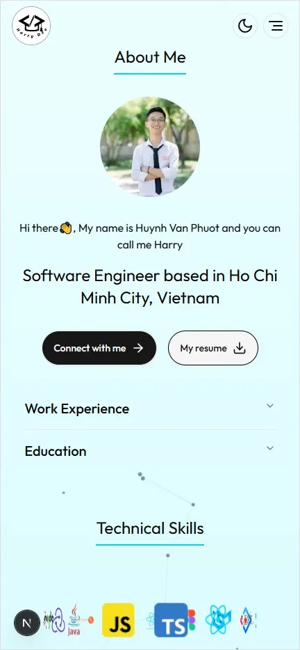
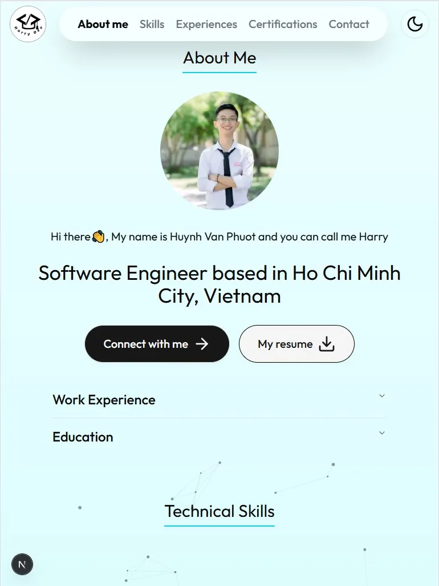
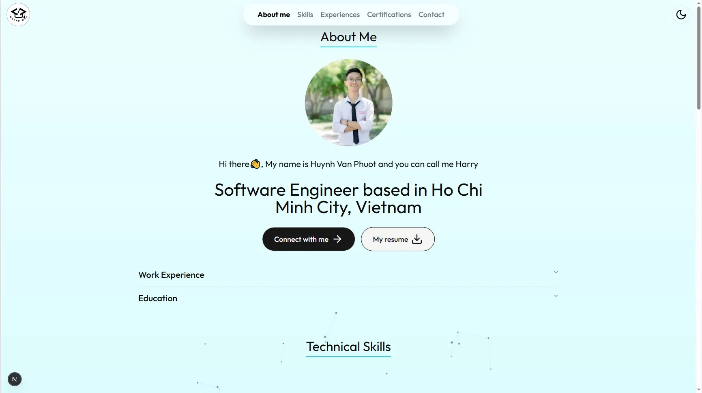

# Portfolio Harry Dev 🚀

Hi there! I'm Huynh Van Phuot, a passionate and curious software engineer who loves turning ideas into reality through code. I specialize in JavaScript, TypeScript, ReactJS, Nextjs, TailwindCSS and enjoy building clean, efficient, and impactful solutions.

This portfolio is a curated collection of my personal and professional projects, showcasing my skills, creativity, and growth as a software engineer. Whether it's solving real-world problems or experimenting with new tech, I'm always eager to learn and build.

## Responsive with all common devices 📱 💻

<p align="center">
  
</p>

<p align="center">
  
</p>

<p align="center">
  
</p>

## Tech Stack 🛠

- React.js
- Next.js
- Shadcn/ui
- TailwindCSS
- Lucide icons

## Demo

- Click [here](https://portfolio-harry-dev-pink.vercel.app/) to view the live demo.

## Getting Started

To get started with this portfolio template, follow these simple steps:

### Prerequisites

Make sure you have react `19.0.0` or higher and next `15.0.0` or higher installed.

### Setup

- With git, clone the code to your machine, or download a ZIP of all the files directly.

```
git clone https://github.com/harrydevdna/portfolio-harry-dev.git
```

```
cd portfolio-harry-dev && code .
```

## Installation

- After opening the files in Visual Studio Code, open the **VS Code** integrated terminal and run the following commands:

```
npm install
```

This will install all the packages and dependencies used in the project.

## Usage

- Run the following command to start a local server:

```
npm run dev
```

## Build

- To create a production build:

```
npm run build
```

## Authors

👤 **Harry Dev**

- GitHub: [harrydevdna](https://github.com/harrydevdna)
- LinkedIn: [harrydevdna](https://www.linkedin.com/in/harrydevdna)

## Feedback and Contributions

If you have any feedback, suggestions, or would like to contribute to this project, your involvement is highly valued. Feel free to reach out to us at phuothuynh2002@gmail.com!

Happy coding and showcasing!

## Support

Give a ⭐️ if you like this project!
